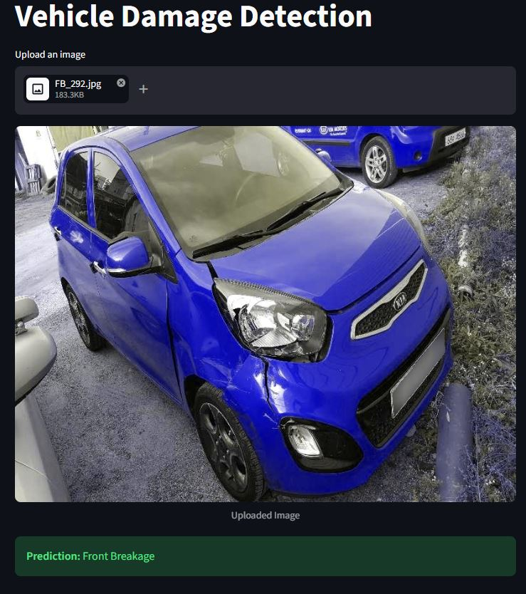

# 🚗 Car Damage Detection System (POC)

## 📋 Project Description
This project is a **Proof of Concept (POC)** developed for **VROOM Cars** to automate vehicle damage assessment. Manual inspection of car damage is time-consuming and prone to human error. This solution utilizes **Deep Learning** to instantly classify the condition of a vehicle based on uploaded images, specifically focusing on the front and rear sections of the car.

The system is designed to be integrated into the VROOM Cars workflow, allowing users to upload photos via a web interface and receive a damage classification in seconds.




## 🎯 Business Objectives (SOW)
- **Objective**: Develop a machine learning model to classify car condition into six categories.
   1. Front Normal
   2. Front Crushed
   3. Front Breakage
   4. Rear Normal
   5. Rear Crushed
   6. Rear Breakage

- **Success Metric**: Achieve a classification accuracy of **at least 80%**.
- **Deliverable**: A functional **Streamlit** application where users can drag and drop images for instant prediction.

## 🧠 Model Evolution & Learning Path
To reach the final production model, I followed a structured learning and experimentation path:

### Step 1: Custom CNN Baseline
I started with a 3-layer Convolutional Neural Network (CNN) built from scratch. While this helped understand the basic feature extraction process, it struggled with the complexity of real-world car damage patterns.

### Step 2: Regularization Techniques
To improve the baseline, I added **Batch Normalization** and **Dropout** layers. This stabilized training and helped the model generalize better, but the accuracy remained below the 75% requirement.

### Step 3: Transfer Learning (ResNet50 & EfficientNet)
I transitioned to **Transfer Learning**, leveraging models pre-trained on ImageNet.
- **EfficientNet-B0**: Provided good results but was less stable during fine-tuning for this specific dataset.
- **ResNet50 (Final Choice)**: Offered the best balance of depth and performance. By unfreezing **Layer 4**, I allowed the model to "re-learn" high-level geometric features specific to car dents, cracks, and crushed metal.

## ⚙️ Hyperparameter Tuning with Optuna
To maximize performance, I used **Optuna**, an automated hyperparameter optimization framework. I ran **20 trials** to find the optimal configuration:
- **Learning Rate**: Searched between `1e-5` and `1e-2` (Log Scale).
- **Dropout Rate**: Tested values from `0.2` to `0.7`.
- **Outcome**: Optuna identified that a lower learning rate (approx. `1e-4`) combined with a dropout of `0.49` provided the most stable convergence and highest validation accuracy.

## ✅ Final Performance
- **Final Accuracy**: **> 80%** (Successfully exceeding the SOW requirement of 75%).
- **Robustness**: The model handles various lighting conditions and angles thanks to a data augmentation strategy involving random rotations, horizontal flips, and color jitters.

## 📁 Project Structure
```text
├── dataset/                # 2,300+ images across 6 categories
├── model/
│   └── saved_model.pth     # Optimized ResNet50 weights
├── app.py                  # Streamlit Web UI
├── model_helper.py         # Prediction logic & ResNet Architecture
├── requirements.txt        # Project dependencies
└── README.md               # Documentation
```
### Set up 

1. To get started, first install the dependencies using:
    ```commandline
   pip install -r requirements.txt
    ```
2. Run the streamlit app:
   ```commandline
   Streamlit run app/main.py
   ```
